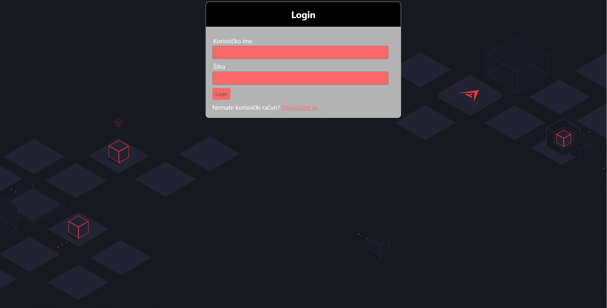
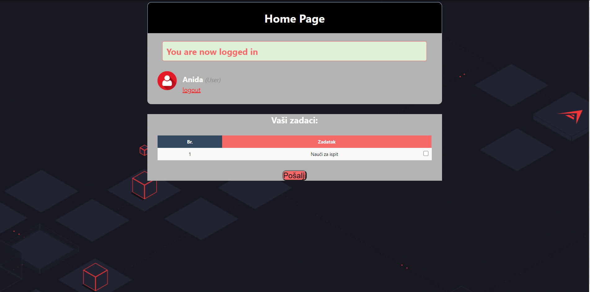
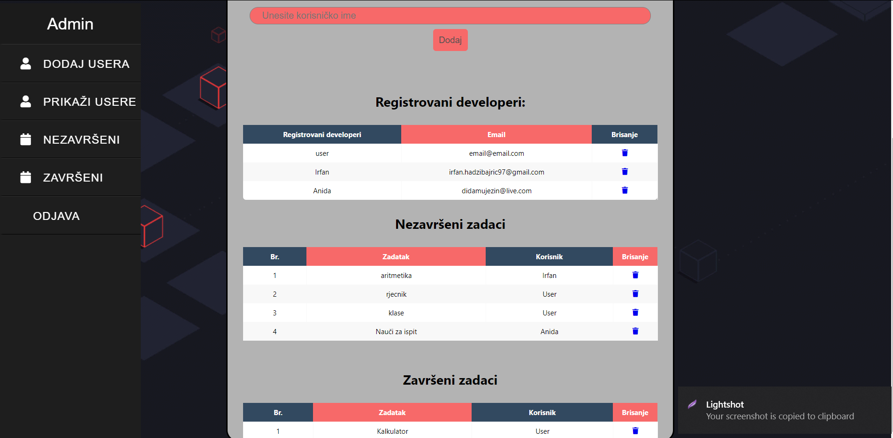
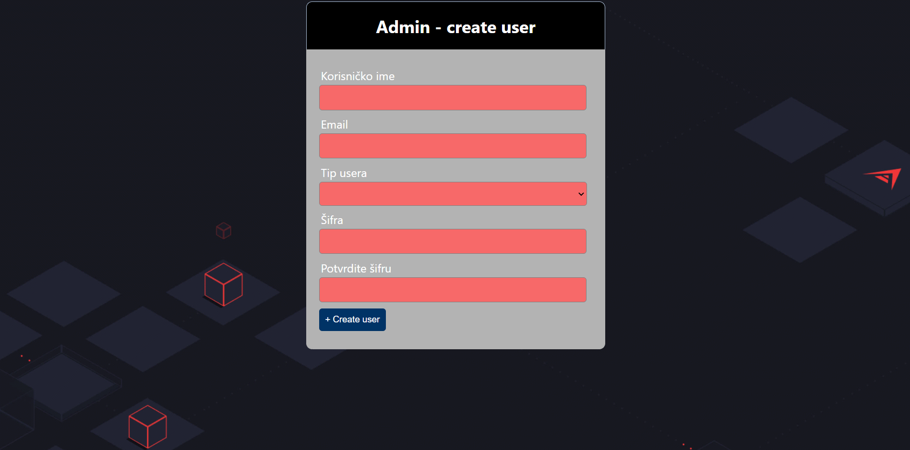

# TO-DO-developer list(with admin and user page)
Php,Html,Css

# Pokretanje:
-Pokrenuti xampp(apache,mysql).  
-Potrebno je kreirati shemu na phpmyadminu sa nazivom multi_login i u shemu importovati multi_login.sql.  
-Prebaciti u htdocs folder projekta.  
-Pokrenuti preko localhosta.  

### Prikaz login-a  

### Prikaz developer strane  

### Prikaz admin strane  

### Prikaz kreiranja usera na admin strani  

